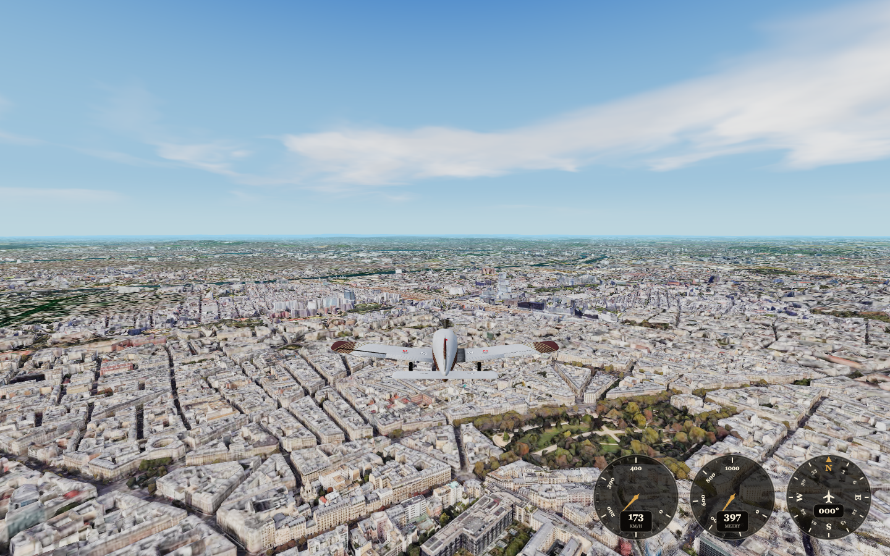
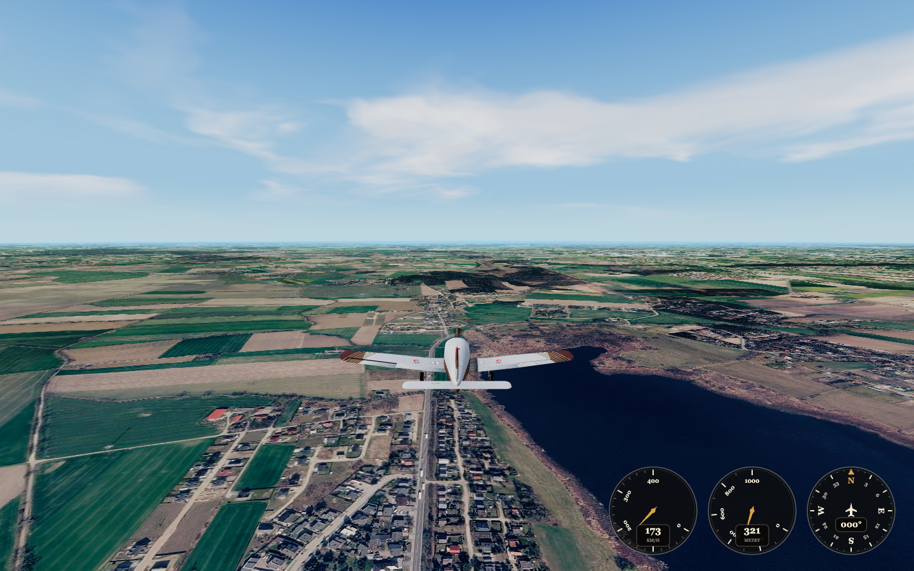
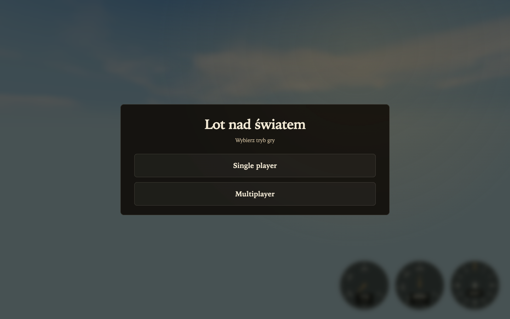
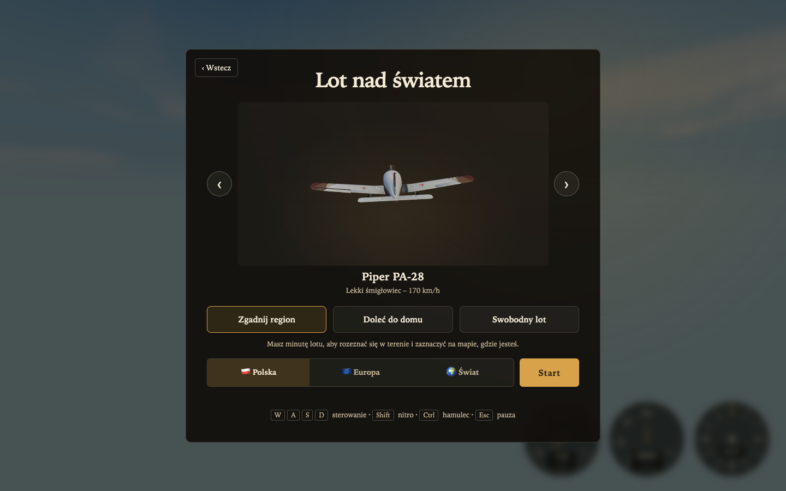
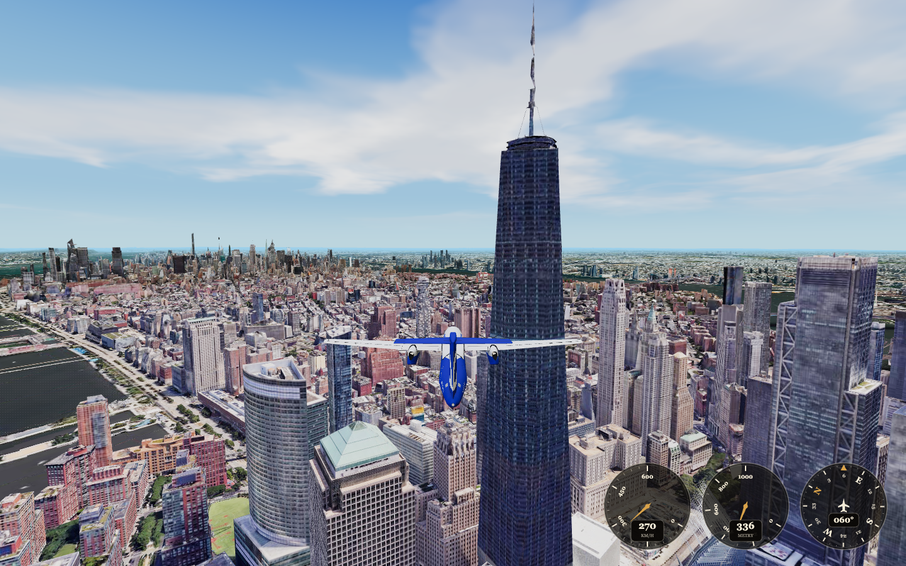
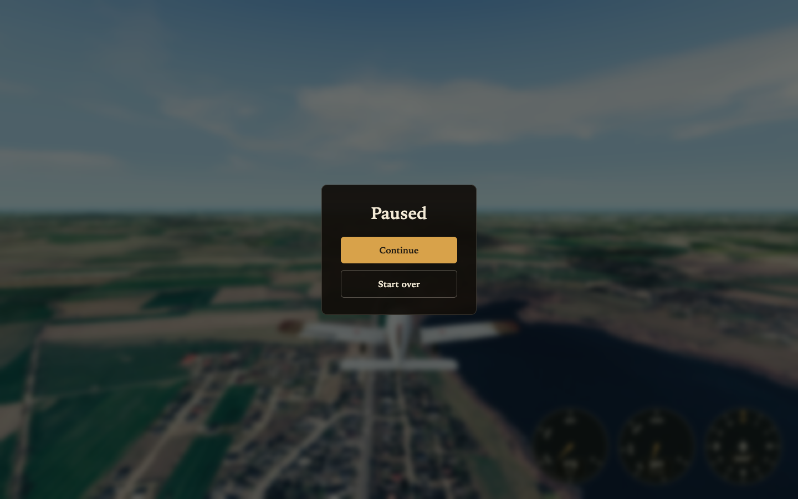

# Lot nad światem

Lot nad fotorealistyczną Ziemią – zgadnij region, doleć do domu albo po prostu lataj. Single player i multiplayer.





## Ekrany

<table>
  <tr>
    <td width="50%"></td>
    <td width="50%"></td>
  </tr>
  <tr>
    <td align="center">Start – single albo multiplayer</td>
    <td align="center">Wybierz samolot, tryb i zakres mapy</td>
  </tr>
  <tr>
    <td></td>
    <td></td>
  </tr>
  <tr>
    <td align="center">Lataj gdzie chcesz</td>
    <td align="center">Pauza w locie</td>
  </tr>
</table>

## Tryby

- **Zgadnij region** – minuta lotu, potem zaznacz na mapie, gdzie jesteś (Polska / Europa / Świat).
- **Doleć do domu** – start ~30 km od wpisanego adresu, 10 minut na powrót.
- **Swobodny lot** – wybierz miasto i lataj.

## Sterowanie

| Klawisz | Akcja |
| --- | --- |
| `W` `A` `S` `D` | Lot |
| `Shift` | Nitro |
| `Ctrl` | Hamulec |
| `T` | Rozmowa (przytrzymaj) |
| `Esc` | Pauza |

## Uruchomienie u siebie

Node.js 18+ i darmowy token [Cesium ion](https://ion.cesium.com/).

```bash
git clone https://github.com/bartosz-ciesielski/lot-nad-swiatem.git
cd lot-nad-swiatem
npm install
cp .env.example .env
```

1. Załóż konto na [ion.cesium.com](https://ion.cesium.com/).
2. Utwórz token (Access tokens).
3. W My Assets dodaj **Google Photorealistic 3D Tiles** (asset `2275207`).
4. Wklej token do `.env` jako `VITE_CESIUM_ION_KEY=…`

```bash
npm run dev
```

Otwórz adres z terminala (zwykle `http://localhost:5173`). W multiplayer jeden klika Multiplayer, drugi wchodzi w skopiowany link.

Klucza nie commituj – `.env` jest w `.gitignore`. W menu kafelki się nie ładują, dopiero po starcie lotu.
